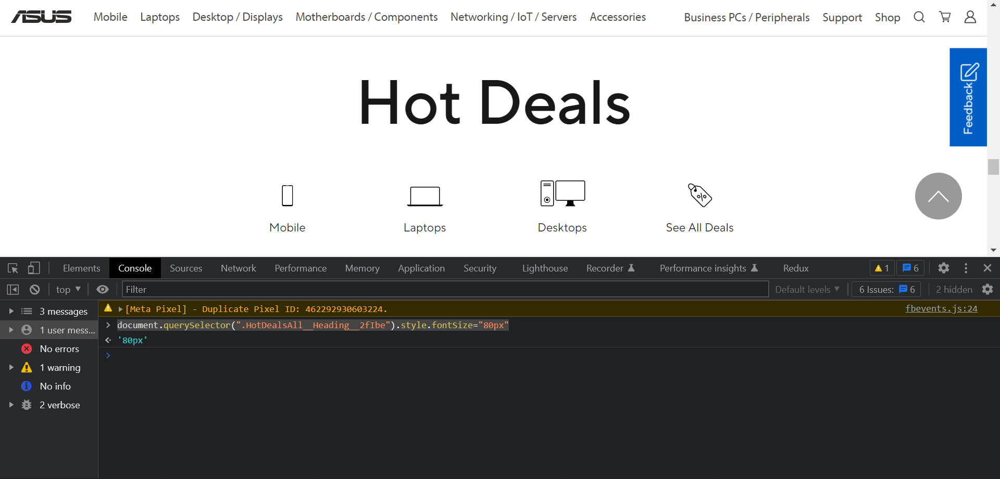
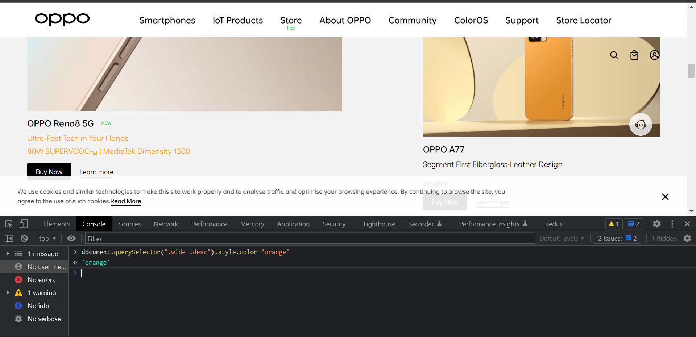

# Dom Manipulation Assignment Answer
## Answer-1
### code
```javascript
//for name
document.querySelector(".side-bar .crayons-card .crayons-subtitle-2 " ).innerText="Prajwal Rajendra zingare "
//for description
document.querySelector(".side-bar .crayons-card p" ).innerText="I am FullStack Javascript Developer and Satvic LifeStyle Follower"
 ```
### output


## Answer-2
### code
```javascript

 ```
 ### output
 

 
## Answer-3
### code
```javascript
const section = document.createElement("section")
section.classList.add("parent")
const newItem=document.querySelector(".accordion-homepage")
const h3=document.createElement("h3");
const textNode = document.createTextNode("My New FAQ");
h3.appendChild(textNode);
newItem.appendChild(section);
section.appendChild(h3);

 ```
 ### output


 
## Answer-4
### code
```javascript
document.querySelector(".contact-us .customer-support a").innerText="+91 1213141516"

 ```
 ### output


## Answer-5
### code
```javascript
document.querySelector(".diwali-deals-product-sale-btn").innerText="Check Out";

 ```
 ### output


## Answer-6
### code
```javascript
document.querySelector(".searchinput___zXLAR").addEventListener("mouseover", function() {
    document.querySelector(".searchinput___zXLAR").style.backgroundColor = "red";
});

 ```
 ### output


## Answer-7
### code
```javascript
function search(Text) {
  let input = document.querySelector("#hp-search-input");
  input.value = Text;
  let form = document.querySelector("#hp-search-form");
  form.submit();
}
search("css");

 ```
 ### output


## Answer-8
### code
```javascript
let arr = document.querySelectorAll("#SIvCob a");
for (i = 0; i < arr.length; i++) {
  if (i % 2 != 0) {
    arr[i].remove();
  }
}
console.log(arr);

 ```
 ### output


## Answer-9
### code
```javascript
document.querySelector(".display-heading-1").style.fontFamily="monospace";
document.querySelector(".display-heading-1").style.color="#b1361e";

 ```
 ### output


## Answer-10
### code
```javascript
document.querySelector(".btn-cta-big .login-btn-text ").addEventListener("mouseover",function(){
    
      document.querySelector(".btn-cta-big .login-btn-text ").style.backgroundColor="red"
    
});

 ```
 ### output


## Answer-11
### code
```javascript
document.querySelector(".gtag .icon").style.backgroundImage="url('https://ineuron.ai/images/ineuron-logo.png')"

 ```
 ### output


## Answer-12
### code
```javascript
document.querySelector(".btn-primary").style.backgroundColor="blue"

 ```
 ### output


## Answer-13
### code
```javascript
   document.querySelector(".fl-heading ").innerText="JS Bootcamp"

 ```
 ### output


## Answer-14
### code
```javascript
  document.querySelector(".HotDealsAll__Heading__2fIbe").style.fontSize="80px"

 ```
 ### output



## Answer-15
### code
```javascript
 document.querySelector(".ps-title").style.textAlign="right"

 ```
 ### output


## Answer-16
### code
```javascript
document.querySelector(".section-title_title__VEDfK").innerText="Start with scrarch"

 ```
 ### output


## Answer-17
### code
```javascript
document.querySelector(".btn-container").innerHTML=new Date()

 ```
 ### output


## Answer-18
### code
```javascript
document.querySelector(".p-f03-footer-container .p-footer").style.backgroundColor="orange"

 ```
 ### output


## Answer-19
### code
```javascript
document.querySelector(".navbar-brand .logo").src

 ```
 ### output


## Answer-20
### code
```javascript
document.querySelector(".wide .desc").style.color="orange"

 ```
 ### output



